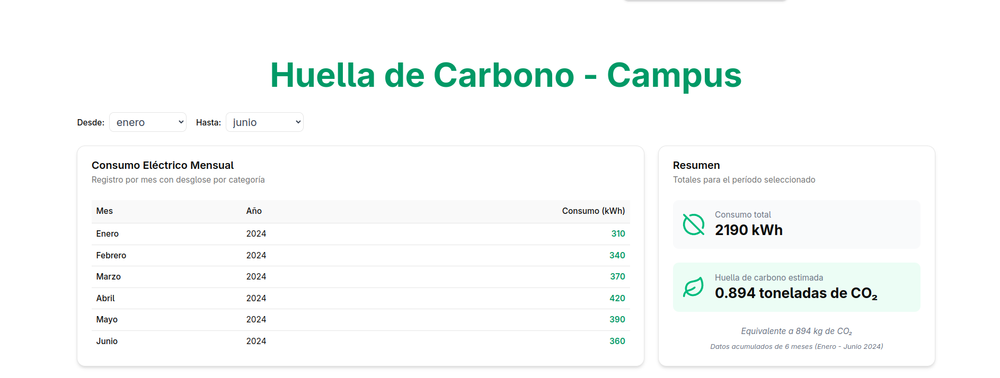

# 🌱 Huella de Carbono - Campus

Este proyecto es una aplicación web educativa que calcula y visualiza la huella de carbono de un campus universitario a partir de datos de consumo eléctrico. Está desarrollado con **React + TypeScript + Vite + shadcn/ui**, e integra visualizaciones dinámicas, filtros por rango de meses y cálculos automáticos.

---

## 🖼️ Vista previa

 <!-- opcional si querés agregar una captura -->

---

## ⚙️ Tecnologías utilizadas

- [React](https://reactjs.org/)
- [Vite](https://vitejs.dev/)
- [TypeScript](https://www.typescriptlang.org/)
- [TailwindCSS](https://tailwindcss.com/)
- [shadcn/ui](https://ui.shadcn.com/)
- [Recharts](https://recharts.org/)
- [Framer Motion](https://www.framer.com/motion/)
- [Python](https://www.python.org/) (para transformar CSV → JSON)
---

## 🚀 Requisitos previos

Asegurate de tener instalado:

- [Node.js](https://nodejs.org/) v18 o superior
- [npm](https://www.npmjs.com/) o [pnpm](https://pnpm.io/)
- [Python 3](https://www.python.org/) (para correr los scripts de conversión)

---

## 🧰 Clonar y ejecutar el proyecto

### 1. Clonar el repositorio

```bash
git clone https://github.com/StefiGil/huella-carbono-campus.git
cd huella-carbono-campus
```
```bash
npm install
```
O si usás pnpm:
```bash
pnpm install
```
Para convertir el archivo consumo_categorias.csv a consumo_por_mes.json, ejecutá:
```bash
cd scripts
python convertir_csv_a_json.py
```
```bash
npm run dev
```


